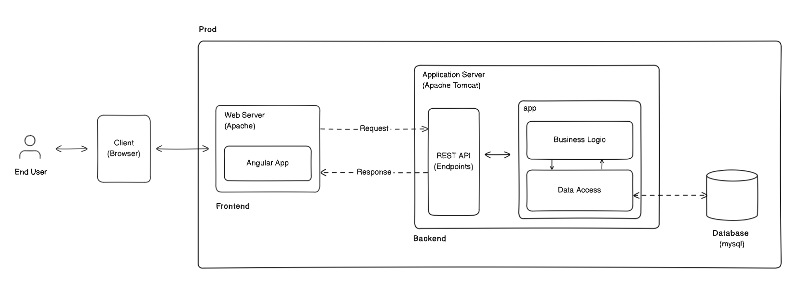

# Architecture Overview

## 1. Introduction

This document provides a high-level overview of the architecture for the **MyProject** application. It covers the main components, their interactions, and the design decisions that have shaped the project.

## 2. System Overview

**MyProject** is a web-based application that consists of a frontend built with Angular and a backend implemented in Java. The application provides users with a way to interact with a MySQL database through a RESTful API.

## 3. Architecture Diagram

## 4. Components

### 4.1 Frontend

- **Technology**: Angular
- **Purpose**: Provides the user interface and handles user interactions.
- **Structure**:
  - **Components**: Individual pieces of the UI (e.g., headers, footers, dashboards).
  - **Services**: Handle data communication with the backend API.
  - **Modules**: Group related components and services.

### 4.2 Backend

- **Technology**: Java (without frameworks)
- **Purpose**: Provides the server-side logic and exposes the API.
- **Structure**:
  - **Servlets**: Handle HTTP requests and responses.
  - **Services**: Contain business logic and interact with the DAO layer.
  - **DAO Layer**: Manages database interactions.
  - **Models**: Represent data structures used in the application.

### 4.3 Database

- **Technology**: MySQL
- **Purpose**: Stores and manages application data.
- **Schema**:
  - **Tables**: Users, Products, Orders, etc.
  - **Relationships**: Define how different tables relate to each other.

## 5. Data Flow

1. **User Interaction**: Users interact with the Angular frontend.
2. **API Requests**: The frontend sends HTTP requests to the backend API.
3. **Backend Processing**: The backend processes requests, applies business logic, and interacts with the database.
4. **Database Interaction**: The DAO layer performs CRUD operations on the database.
5. **Response**: The backend sends a response back to the frontend, which updates the UI accordingly.

## 6. Design Decisions

### 6.1 Stateless API

- **Reasoning**: The API is designed to be stateless to ensure scalability and simplicity in managing user sessions.

### 6.2 Separate Data Access Layer

- **Reasoning**: Separation of concerns allows for better organization of code and easier maintenance. The DAO layer abstracts database operations from business logic.

### 6.3 Angular for Frontend

- **Reasoning**: Angular provides a robust framework for building dynamic and responsive user interfaces, with features like two-way data binding and dependency injection.

## 7. Scalability Considerations

- **Horizontal Scaling**: Both frontend and backend can be scaled horizontally by adding more instances.
- **Database Optimization**: Indexes and query optimization are used to improve performance.

## 8. Security Measures

- **Authentication**: User authentication is handled using JSON Web Tokens (JWT).
- **Data Encryption**: Sensitive data is encrypted both at rest and in transit.

## 9. Future Enhancements

- **Microservices**: Consider breaking down the monolithic backend into microservices for better scalability.
- **CI/CD Pipeline**: Implement a continuous integration and continuous deployment pipeline for automated testing and deployment.
- **Two-Tier-System-Landscape**: Seperate production environment from development environment for an appropriate change management.

## 10. References

- **Project Documentation**: [README.md](../README.md)
- **API Documentation**: [API.md](../docs/API.md)
- **Database Schema**: [Schema Documentation](../docs/DATABASE_SCHEMA.md)